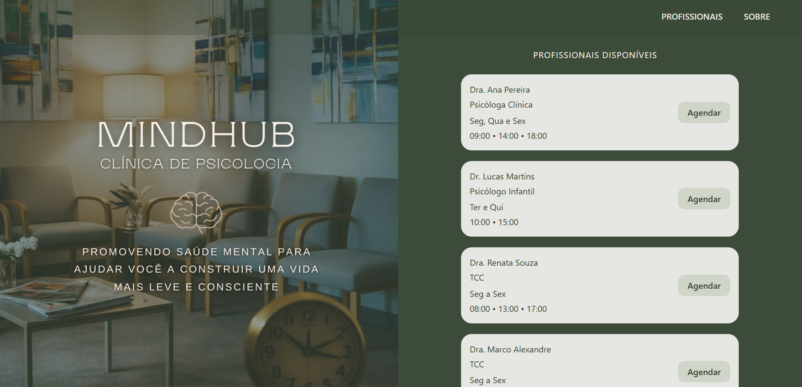

# MindHub - Clínica de Psicologia

Sistema web desenvolvido para gerenciamento e agendamento de profissionais de psicologia.

Interface moderna, elegante e focada em experiência do usuário, com layout dividido e identidade visual em tons de verde.

---

## Preview

Interface com:
- Tela dividida
- Imagem institucional com overlay
- Lista de profissionais disponíveis
- Botão de agendamento
- Design clean e responsivo

---

## Tecnologias Utilizadas

- Angular
- TypeScript
- HTML5
- CSS3
- Flexbox
- Git & GitHub

---

## Layout

O sistema possui:

- Lado esquerdo: imagem institucional com overlay e identidade visual
- Lado direito: listagem de profissionais disponíveis
- Cards modernos com botão de agendamento
- Paleta baseada em verde institucional

---

## Estrutura do Projeto
